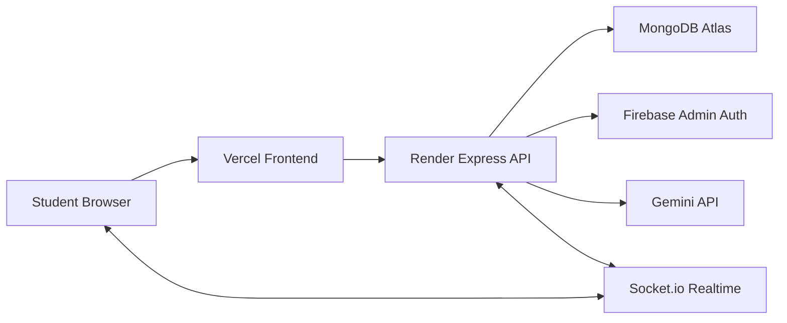

# EngineerConnect AI Architecture

## Product Boundary

EngineerConnect AI is a production-oriented monorepo for engineering-student networking, project collaboration, hackathon team formation, and AI-assisted career planning.

The application is split into:

- `frontend/`: React, TypeScript, Vite, Tailwind CSS, shadcn-style primitives, React Router, Zustand.
- `backend/`: Node.js, Express, TypeScript, MongoDB Atlas, Mongoose, Firebase Authentication verification, Gemini API, Socket.io.
- `docs/`: architecture, database, API, and implementation references.

## Runtime Topology

## Authentication Flow

1. The frontend signs the student in with Firebase Google Auth.
2. Firebase returns an ID token to the browser.
3. The frontend sends `Authorization: Bearer <firebase_id_token>` to the backend.
4. Backend middleware verifies the token with Firebase Admin.
5. Backend upserts a `User` record and attaches `req.user`.
6. Protected API routes use that authenticated user id for ownership and authorization.

## Backend Layers

- `config/`: database, Firebase, Gemini, app environment.
- `middleware/`: authentication, validation, security, error handling, rate limiting.
- `models/`: Mongoose schemas and indexes.
- `validators/`: request validation schemas.
- `services/`: domain logic, AI prompts, matching algorithm, roadmap generation.
- `controllers/`: HTTP orchestration and response shaping.
- `routes/`: API route definitions.
- `utils/`: logging, async helpers, normalized errors.

## Frontend Layers

- `routes/`: router setup and protected-route boundary.
- `layouts/`: public and app shells.
- `pages/`: route-level views.
- `components/`: reusable UI and domain components.
- `services/`: typed API clients and Firebase client.
- `store/`: Zustand stores for auth, profile, and app state.
- `hooks/`: composable data and UI hooks.
- `types/`: shared frontend domain types.

## Core Domains

- Identity: Firebase-authenticated users stored in MongoDB for application-level relationships.
- Profiles: student details, skills, goals, projects, achievements, and external links.
- Matching: MongoDB-backed compatibility calculations between real profiles.
- Projects: marketplace records, applications, invitations, and membership.
- Hackathon Teams: team records, roles, join requests, and AI role suggestions.
- Roadmaps: Gemini-generated career plans persisted per student.
- Notifications: persisted notification feed with realtime delivery through Socket.io.

## Deployment Model

- Frontend deploys to Vercel with `VITE_*` environment variables.
- Backend deploys to Render with MongoDB, Firebase Admin, Gemini, JWT, and CORS environment variables.
- MongoDB Atlas stores all application data.
- Socket.io runs on the backend service and accepts the same Firebase-authenticated user context.

Deployment config files:

- `vercel.json`: Vercel frontend build/output and SPA rewrite config.
- `render.yaml`: Render backend blueprint.
